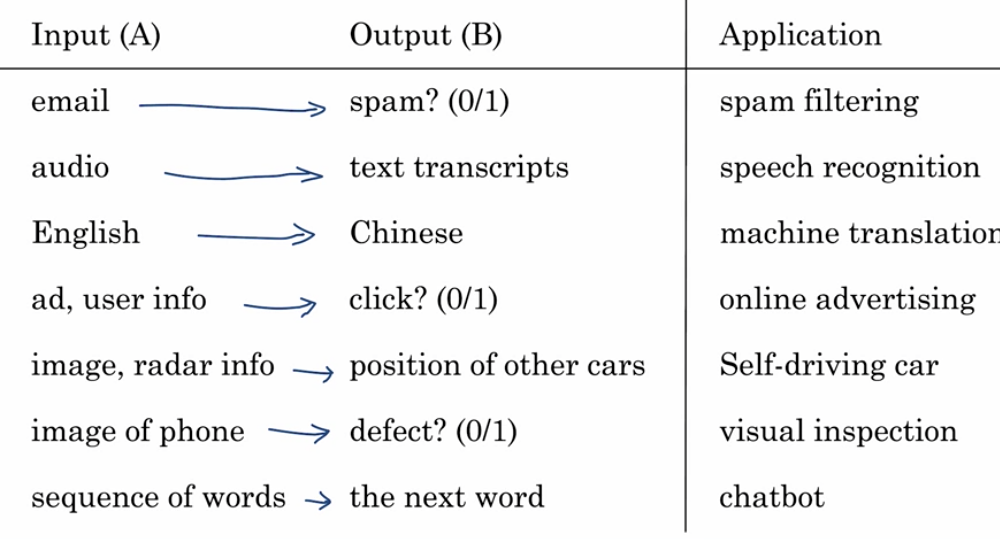
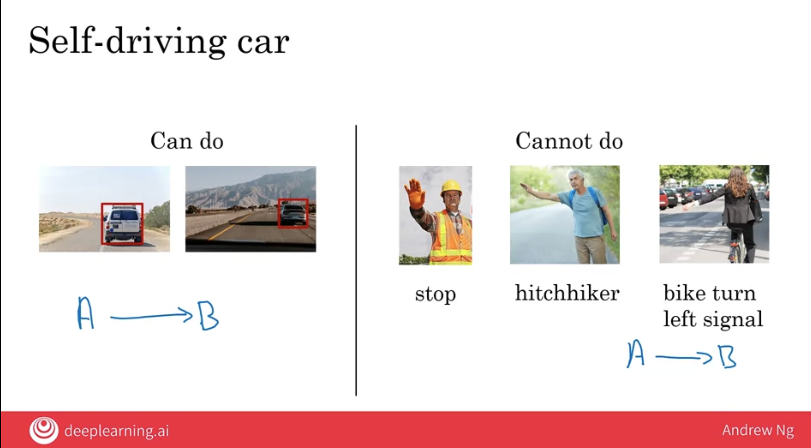
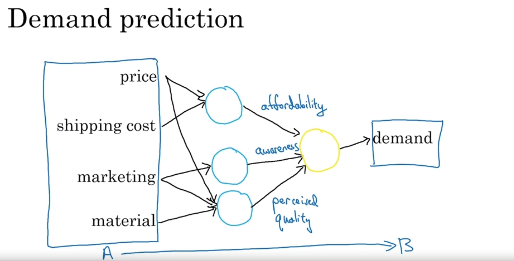

# Week 1: What is AI?

Presentation: [week 1](docs/wk1/W1.pdf)

## AI subcatagories

- ANI: Artificial **Narrow** Intelligence
    - "One trick pony", e.g. smart speaker, self-driving car, web search, AI in farming or factories 
- GenAI: Generative AI
    - chatgpt, bard, dall-e, midjourney
- AGI: Artificial General Intelligence
    - Do anything a human can do

There is a concept of Strong AI and Super AI that I should be aware of that I believe fall under AGI. 

> NOTE: Although we are making great progress in ANI and GenAI, we are very far awary from AGI. e.g. decades or more

## Machine Learning

### Supervised Learning
The most commonly used type of machine learning is a type of AI that learns A to B or input to output mappings, and this is called supervised learning.

LLMs: Large Language Models are built by using supervised learning (A-->B) to repeateldy predict the next word.

> Note: to learn details of GenAI, take the course titled GenAI for Everyone.

#### What is data?

Your data (aka dataset) is unique to the business or your personal needs.

The more data (Big Data) you can train a model (nueral network) the much better AI performance you will gain.

Acquiring Data
- Manual labeling: collecting the specific data manually
- From observing behaviors
- Download from websites (the world wide web dataset) / partnerships (e.g. companies that already have a large dataset specific to their domain)

Data can be messy? (garbage in, garbage out)

- Structured Data (e.g. tabular)
- Unstructured Data

Both can have missing, inaccurate data that would need to be handled. Either cleaned or understood how it will be treated in the models.

Supervised learning can work very well for both of these types of data, unstructured data and structured data

#### AI Terminology

Machine Learning vs Data Science

Machine learning is the field of study that gives computers the ability to learn without being explicitly programmed. This is a definition by Arthur Samuel.

Data science is a science of extracting knowledge and insights from data.

Deep learning

#### What makes an AI company?

High level playbook to become effective in a AI Transformation:
1. Execute pilot projects to gain momentum
2. Build an in-house AI team
3. Provide broad AI training
4. Develop an AI strategy
5. Develop internal and external communications

#### What machine learning can and cannot do

In practice before committing to a specific AI project, perform technical dillegence on a project to make sure that it is feasible. 
This means looking at data, input and output, A and B, to really understand if this is something AI can do. 

What makes an ML problem easier?
1. Learning a "simple" concept: Less than one sec of mental thought
2. Lots of data available (that includes both A and B data)

#### More examples of what machine learning can and cannot do

Concreate examples
- Self-driving car

- X-ray diagnosis

#### Demystify Deep-Learning

A neural network is a group of artificial neurons, each of which computes a relative simple function. But when you stack enough of them together, like lego breaks, they can compute incredibly complicated functions that give you very accurate mappings from the input A to the output B

- A nueron is key to a nueral network (aka model) that does A to B mapping. 
- Multiple nuerons in a network, all doing their own A to B mapping can then feed their output as input (A) to a seperate distinct nueron that will output (B). 

- To train a neural network, in other words, to build a machine learning system using a neural network, all you have to do is give it the input A and the output B, and it figures out all of the things in the middle by itself.
- To build a neural network, what you would do is feed it lots of data with the input A and have a neural network that just looks like this with a few blue neurons feeding to a yellow output neuron. 
- And then you have to give it data with the demand B as well. And it's the software's job to figure out what these blue neurons should be computing so that it can completely automatically learn the most accurate possible function, mapping from the input A to the output B. 
- And it turns out that if you give this enough data and train a neural network that is big enough, this can do an incredibly good job mapping from inputs A to outputs B.