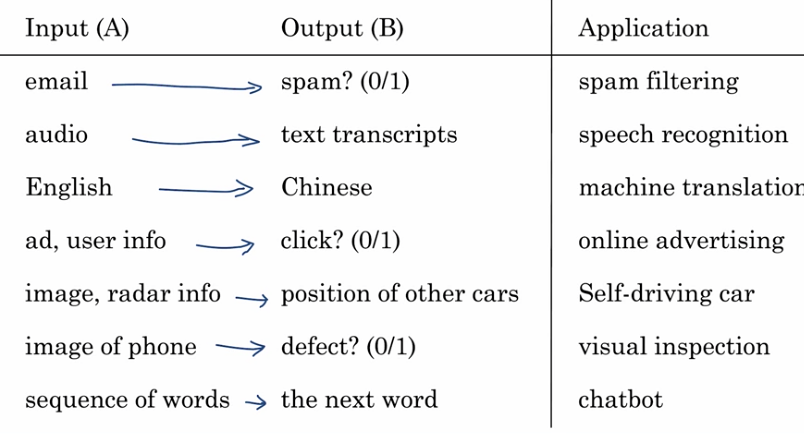

# Week 1: What is AI?

## AI subcatagories

- ANI: Artificial **Narrow** Intelligence
    - "One trick pony", e.g. smart speaker, self-driving car, web search, AI in farming or factories 
- GenAI: Generative AI
    - chatgpt, bard, dall-e, midjourney
- AGI: Artificial General Intelligence
    - Do anything a human can do

There is a concept of Strong AI and Super AI that I should be aware of that I believe fall under AGI. 

> NOTE: Although we are making great progress in ANI and GenAI, we are very far awary from AGI. e.g. decades or more

## Machine Learning

### Supervised Learning
The most commonly used type of machine learning is a type of AI that learns A to B or input to output mappings, and this is called supervised learning.

LLMs: Large Language Models are built by using supervised learning (A-->B) to repeateldy predict the next word.

> Note: to learn details of GenAI, take the course titled GenAI for Everyone.

#### What is data?

Your data (aka dataset) is unique to the business or your personal needs.

The more data (Big Data) you can train a model (nueral network) the much better AI performance you will gain.

Acquiring Data
- Manual labeling: collecting the specific data manually
- From observing behaviors
- Download from websites (the world wide web dataset) / partnerships (e.g. companies that already have a large dataset specific to their domain)

Data can be messy? (garbage in, garbage out)

- Structured Data (e.g. tabular)
- Unstructured Data

Both can have missing, inaccurate data that would need to be handled. Either cleaned or understood how it will be treated in the models.

Supervised learning can work very well for both of these types of data, unstructured data and structured data

#### AI Terminology
>continue here