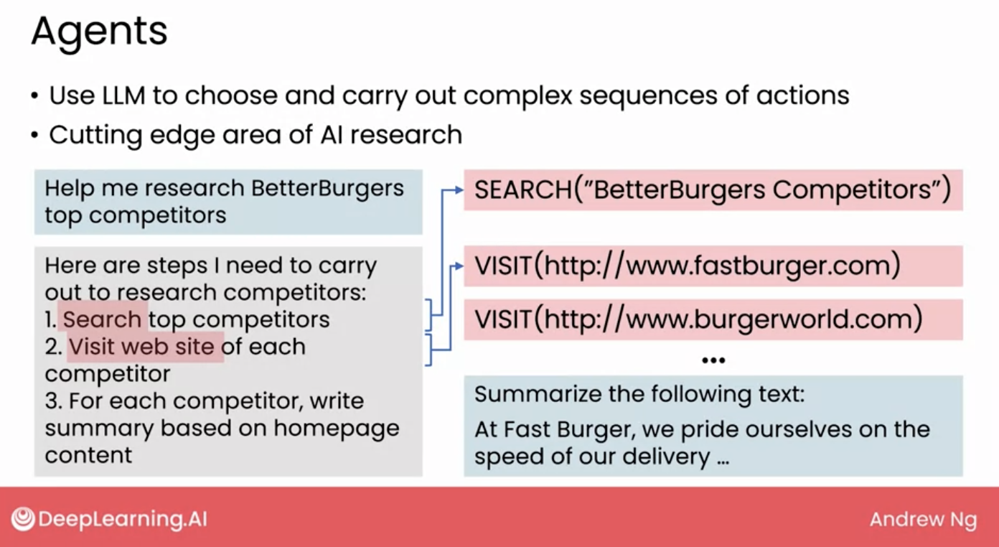

# Generative AI Projects

Review [week 2 pdf](./docs/W2.pdf)

## Software applications

- Writing
- Reading
- Chatting

## Advanced technologies: Beyond prompting

### Retrieval Augmented Generation (RAG)

### Fine-tuning

### Pre-training

## Choosing a model

- Model size (number of parameters)
- Closed source (cloud programming interface)
- Open source

## How LLMs follow instructions: Instruction tuning and RLHF
Reinforcement learning from human feedback (RLHF)

## Tool use and agents 

- Agents: Use LLM to choose and carry out complex sequences of actions. 
