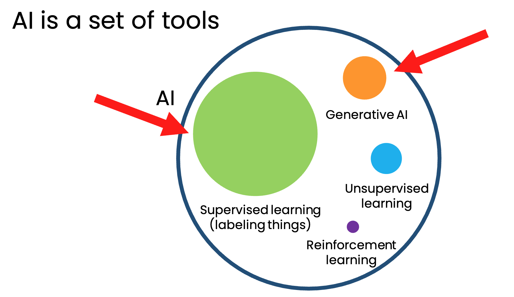
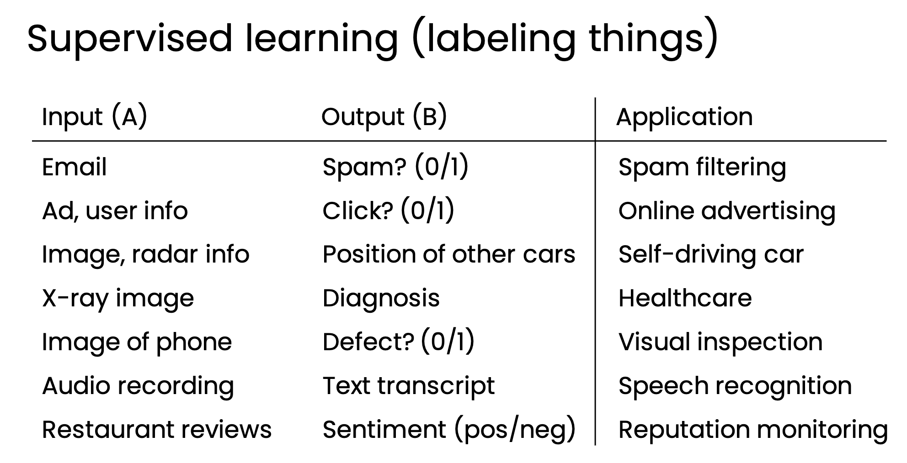

# How Generative AI works

#### What is Generative AI?

Artifical intelligence systems that can produce high quality contect specifically test, images, audio.

AI is a set of tools

> KEY: GenAI is built by using supervised learning

Supervised learning (labeling things)

### Generating text using Large Language Models (LLMs)

LLMs are built by using supervised learning (A→B) **to repeatedly predict the next word.**

When we train a very large AI system on a lot of data (hundreds of billions of words), 
we get a Large Language Model like ChatGPT.

LLMs can make facts up which is called hallucination.

### AI is a general purpose technology

Writng, reading and chating tasks

Web-based vs. software application use of LLMs

Web-based interface applications e.g. ChatGPT, Gemini, or Bing Chat

Software-based applications e.g. email routing, document search